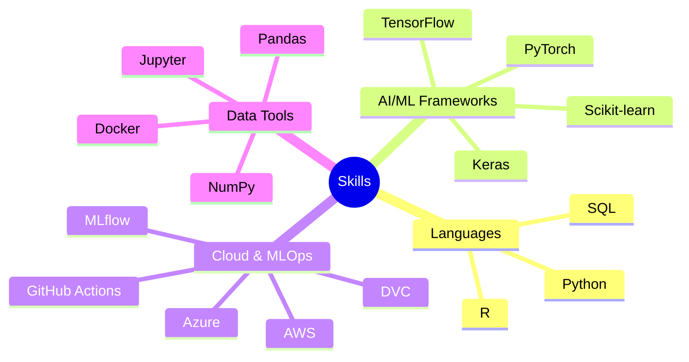

# 👋 Hi, I'm Parth Panchal

  

## 🚀 About Me
I'm a passionate AI/ML Engineer with 2 years of hands-on experience in developing and deploying machine learning solutions. My journey in tech is driven by an insatiable curiosity to explore cutting-edge AI technologies and contribute to meaningful open-source projects.

### What Drives Me 🎯
- 🧠 **Innovation**: Pushing the boundaries of what's possible with AI/ML
- 🌱 **Continuous Learning**: Always exploring new technologies and methodologies
- 🤝 **Community**: Contributing to open-source projects and knowledge sharing
- 🎯 **Impact**: Building solutions that make a difference

## 💻 Technical Arsenal

### Languages & Core Tools

### Detailed Expertise 🛠️

| Category | Technologies |
|----------|-------------|
| **AI/ML Frameworks** |     |
| **Cloud Platforms** |    |
| **MLOps Tools** |    |
| **Development** |    |

## 📈 GitHub Stats

  

## 🤝 Let's Connect!

---

### 💡 "The only way to do great work is to love what you do." - Steve Jobs

<!---
## 📈 GitHub Stats

--->

<!---
Parth189p/Parth189p is a ✨ special ✨ repository because its `README.md` (this file) appears on your GitHub profile.
You can click the Preview link to take a look at your changes.
--->
